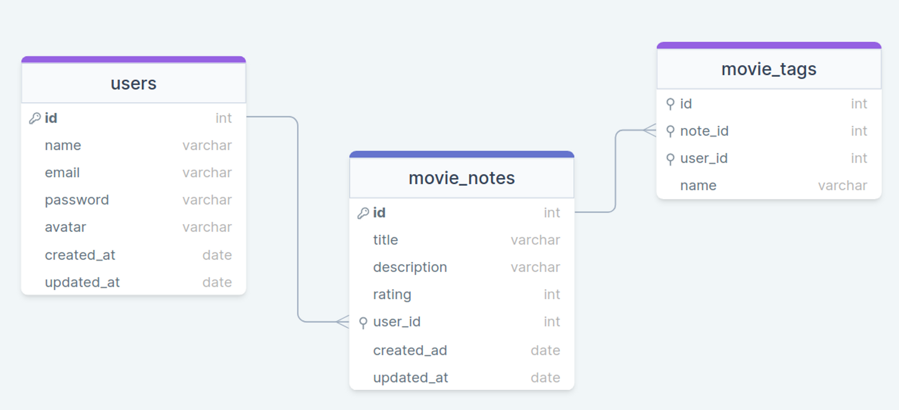

<h1 align="center"> RocketMovie </h1>

Este projeto é promovido pela Rocketseat para ensino de tecnologias WEB.  

  <a href="#-tecnologias">Tecnologias</a>&nbsp;&nbsp;&nbsp;|&nbsp;&nbsp;&nbsp;
  <a href="#-projeto">Projeto</a>&nbsp;&nbsp;&nbsp;&nbsp;&nbsp;&nbsp;

 

  

## 🚀 Tecnologias

Esse projeto foi desenvolvido com as seguintes tecnologias:

- NodeJs
- Express
- SQL
- JavaScript
- Git

## 💻 Projeto

Projeto realizado no Stage 08, na plataforma da Rocketseat para consolidar conhecimentos adquiridos sobre JavaScript, NodeJS, SQL, Express, boas práticas de codificação no Backend, rotas, arquitetura de projetos, NPM x NPX entre outros. A proposta do desafio era iniciar o projeto backend do sistema Rocket Movie com os conhecimentos adquiridos até o momento.
